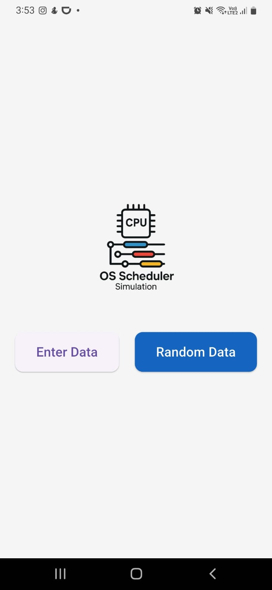
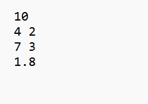
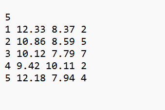

# 🧠 OS Scheduling Visualizer

A fully-featured Flutter application that simulates and visualizes CPU scheduling algorithms in an interactive and intuitive way.  
Designed for both manual and file-based input, this project also includes a **Process Generator Module** that creates randomized process data based on configurable statistical distributions (e.g., mean, standard deviation, and lambda).

This tool aims to make operating system scheduling concepts more accessible, visual, and engaging for both students and developers.

---
## 🎬 Live Demo

Watch the Mobile app in action here:

Watch the Windows app in action here:

## 🚀 Key Features

✅ **Supported Scheduling Algorithms**
- FCFS (First Come First Served)
- SRTF (Shortest Remaining Time First - Preemptive)
- HPF (Highest Priority First - Non-Preemptive)
- Round Robin (with customizable quantum)

✅ **Multiple Input Options**

- ✍️ Enter process data manually via the app interface

- 🔁 Generate random processes automatically from the input file

- 📂 Upload a configuration input file with the following format:

  Line 1: Number of Processes
  Line 2: Mean and Standard Deviation for Arrival Time
  Line 3: Mean and Standard Deviation for Burst Time
  Line 4: Lambda for Priority

Example:

- ⚙️ The app's generator module will then produce an **output file** with the actual process data in the following format:

  Line 1: Number of processes
  Line 2: process_ID arrival_time burst_time priority
  Line 3+: Each process on its own line

Example:

✅ **Comprehensive Results Output**

- Waiting Time and Turnaround Time calculated for each process
- Execution table (who started when and finished when)
- Gantt Chart showing execution order with start and end times
- Bar charts summarizing all results visually

✅ **Clean UI with Flutter **
- Interactive charts
- Process display tables
- Clear distinction between algorithms and input modes

---

## 📂 Project Structure

- `lib/` — Main Flutter source files
- `input.txt` — Example input file for random process generation
- `README.md` — This file 😉

---

## 🛠 Technologies Used

- **Flutter (Dart)** — Cross-platform app development framework
- **fl_chart** — For building interactive bar and line charts
- **file_picker** — To allow users to select input and output files
- **path_provider** — For accessing device directories for file operations
- **flutter_native_splash** — To display a custom splash screen on app launch
- **Object-Oriented Programming (OOP)** — Used to structure scheduling algorithm logic
- **File I/O** — Reading and writing text files for input/output process data

---

## 🧪 How to Run

1. Clone the repository:

git clone https://github.com/jana-h-any/os-schedules.git

2. Navigate to the project directory:

cd os-schedules

3. Install dependencies:

flutter pub get

4. Run the app:

flutter run

### 👩‍💻 Developed By

**Jana Hany Mostafa**

## 📬 Contact

GitHub: @jana-h-any

LinkedIn: [linkedin.com/in/jana-hany]

Email: [janahanymostafa016@gmail.com]

## 📝 License

This project is open source and available under the MIT License.
